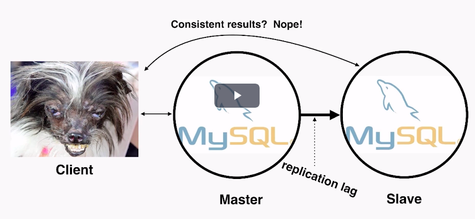

# Cassandra

# Introduction

## Problems while scaling Relational Databases

### Replication: ACID is a lie

Data is replicated asynchronously, this is known as replication lag. When the client decides to write to the master it takes some time to replicate to the salve. If the client decided to do a read, it gets the old data back. Hence the data is not consistent.

### Third Normal Form doesn't Scale

- Queries are unpredictable
- Takes time to execute
- Data must be denormalized
- If data > memory, you = history
- Disk seeks are the worst

To be able to query data faster, we generally create denormalized views, which essentially takes away any benefits we could reap from having the data in the normalized form

### Sharding is a Nightmare

- Data is all over the place
- No more joins
- No more aggregations
- Denormalize all the things
- Querying seconding indexes requires hitting every shard
- Adding shards requires manually moving the data
- Schema changes - Apply schema changes to all of the shares in the system, both master and slave

### High Availability.. not really

- Master failover.. who's responsible? 
  - Another moving part... - Who will bring up the master if it is crashed, if there is an automated service, who will bring up the automated service when that itself is down
  - Bolted on hack
- Multi-DC is a mess - In case of multiple data centers it is hard to manage manually
- Downtime is frequent
  - Change database settings - needs restart
  - Driver, power supply failures
  - OS updates

**Goad here is to achieve a higher availability than what a master slave architecture offers**

### Summary of Failure

- Scaling is a pain
- ACID is naive at best
  - You aren't consistent
- Re-sharding is a manual process
- We're going to denormalize for performance
- High availability is complicated, requires additional operation overhead

 