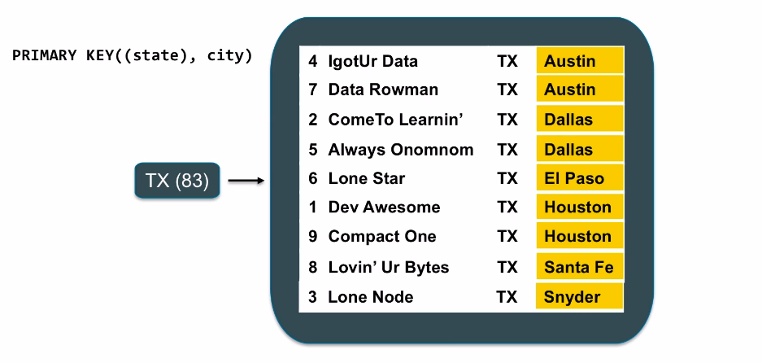

[TOC]


# Introduction

## Problems while scaling Relational Databases

### Replication: ACID is a lie

Data is replicated asynchronously, this is known as replication lag. When the client decides to write to the master it takes some time to replicate to the salve. If the client decided to do a read, it gets the old data back. Hence the data is not consistent.


### Third Normal Form doesn't Scale

- Queries are unpredictable
- Takes time to execute
- Data must be denormalized
- If data > memory, you = history
- Disk seeks are the worst

To be able to query data faster, we generally create denormalized views, which essentially takes away any benefits we could reap from having the data in the normalized form

### Sharding is a Nightmare

- Data is all over the place
- No more joins
- No more aggregations
- Denormalize all the things
- Querying seconding indexes requires hitting every shard
- Adding shards requires manually moving the data
- Schema changes - Apply schema changes to all of the shares in the system, both master and slave

### High Availability.. not really

- Master failover.. who's responsible? 
  - Another moving part... - Who will bring up the master if it is crashed, if there is an automated service, who will bring up the automated service when that itself is down
  - Bolted on hack
- Multi-DC is a mess - In case of multiple data centers it is hard to manage manually
- Downtime is frequent
  - Change database settings - needs restart
  - Driver, power supply failures
  - OS updates

**Goad here is to achieve a higher availability than what a master slave architecture offers**

### Summary of Failure

- Scaling is a pain
- ACID is naive at best
  - You aren't consistent
- Re-sharding is a manual process
- We're going to denormalize for performance
- High availability is complicated, requires additional operation overhead

### Lessons Learned

- Consistency is not practical
  - So we give it up
- Manual sharding & rebalancing is hard - meeds writing a lot of code
  - So let's build in - push the responsibility to the cluster
- Every moving part makes systems more complex
  - So let's simplify our architecture - no more master/ slave
- Scaling is expensive - vertical scaling is expensive, only use commodity hardware
- Scatter/ gather no good - We want to achieve data locality, so that there is no extra latency in scaling the entire cluster to retrieve records. This is done with better data modeling

## Cassandra Overview

### What is Apache Cassandra?

- Fast distributed database
- High availability
- Linear scalability
- Predictable performance
- NO single point of failure
- Multi - data center
- Commodity Hardware
- Easy to manage operationally
- Not a drop in replacement for RDBMS - **Have to design the application around Cassandra's data model, we cannot just simply follow the same data model in Cassandra**

### Hash Ring

- No master/ slave/ replica sets
- No config servers, zookeeper
- Data is partitioned around the ring
- Data is replicated to RF=N servers
- All nodes hold data and can answer queries (both read & writes)
- Location of data on ring is determined by partitioned key


**When we create a table in Cassandra we assign a partition key, the value of the partition key is run through a consistent hashing function and the depending on the output it is determined in which node the data will be stored** 

### CAP Tradeoffs

- Impossible to be both consistent and highly available during a network partition
- Latency between data centers also makes consistency impractical
- Cassandra chooses Availability & Partition tolerance over Consistency

### Replication

How many copies of each piece of data should there be on the cluster

- Data is replicated automatically
- You pick number of servers
- Called "replication factor" or RF
- Data is ALWAYS replicated to each replica
- If a machine is down, missing data is replayed via a hinted handoff


### Consistency Level

- Per query consistency - for both read and write
- Replicated factor is honored irrespective of the Level of the Consistency
- How many replicas for query to respond to OK
  - ALL - All replicas
  - QUORUM - Majority, so in case of replication of 3, this implies 2 out of 3 (51% or greater)
  - ONE - One replica

**Consistency level has impact on how fast we can read or write data, it is also going to impact the availability, if the consistency level is set to all, even a single node failing can make the cluster unavailable. With Level 1, the cluster will be highly available**

### Multi DC

- Typical usage: clients write to local DC, replicates async to other DCs
- Replication factor per keyspace per datacenter
- Datacenters can be physical or logical


**Logical datacenters are useful for segregating OLTP queries which need fast responses to OLAP queries, hence the data will be un sync, but Analytics queries will not impact the OLTP queries**


## Cassandra Internals and Choosing a Distribution

### The Write Path

- Writes are written to any node in the cluster (Coordinator) - **Whatever node you happen to be talking to in that request**, for that write request this node does the coordination - (**like a temp master**)
- Writes are written to commit log, then to memtable  - **commit log is an append only datastructure, it is going to be sequential IO** , then it merges to the memtable, which is an in-memory representation of the table
- Every write includes a timestamp
- Memtable flushed to disk periodically (sstable) - **When the memtable starts to exceed the memory, we flush it to disk as sstable** 
- New memtable is created in memory
- Deletes are a special write case, called a "tombstone" -  **Cassandra never does any updates in-place or deletes in-place, the sstables are immutable, commit log is immutable. So when we delete something Cassandra just marks that there is no data here, a tombstone has a timestamp and it indicates that there is no data at that particular timestamp for which we deleted a record**


### What is an SSTable?

- Immutable data file for row storage 
- Every write includes a timestamp of when it was written
- Partition is spread across multiple SSTables
- Same column can be in multiple SSTables
- Merged through compaction, only latest timestamp is kept
- Deletes are written as tombstones
- Easy backups!


### The Read Path

- Any server may be required, it acts as the coordinator
- Contacts nodes with the requested key
- On each node, data is pulled from SSTables and merged
- Consistency<ALL performs read repair in background (read_repair_chance) - **This the chance that whenever you do a read, all the nodes have the latest updated data**. The default value is 10%, so for 10% of the reads Cassandra is going to attempt to keep all of the data in sync.


**The storage type SSD vs HDD is going to have a huge impact on the read performance**

### Picking a distribution

#### Open Source

- Perfect for hacking
- Latest, bleeding edge features

#### DataStax Enterprise

- Integrated Multi-DC Search
- Integrated Spark for Analytics
- Focused on stable releases for enterprise
- Additional QA


# Foundations

## CQL

### Keyspaces

- Top-level namespace/container
- Similar to a relational database schema

```CQL
CREATE KEYSPACE killrvideo
WITH REPLICATION = {
	'class': 'SimpleStrategy',
	'replication_factor': 1
};
```

- Replication parameters required

### USE

- USE switches between keyspaces

```cql
USE killrvideo;
```

### Tables

- Keyspaces contain tables
- Tables contain data

```cql
CREATE TABLE table1 (
    column1 TEXT,
    column2 TEXT,
    column3 TEXT,
    PRIMARY KEY (column1)
);

CREATE TABLE users (
    user_id UUID,
    first_name TEXT,
    last_name TEXT,
    PRIMARY KEY (user_id)
);
```

### UUID and TIMEUUID

**Used in place of integer IDs because Cassandra is a distributed database**

- Universally Unique Identifier
  - Generate via uuid()

- TIMEUUID embeds a TIMESTAMP value
  - Sortable
  - Generate via now()
  - Time can be extracted from TIMEUUID

**UUID enabled nodes to generate unique ids without any inter-node communication**

### INSERT

**Similar to relational syntax**

```cql
INSERT INTO users (user_id, first_name, last_name)
VALUES (uuid(), 'Joseph', 'Chu')
```

### COPY

- Imports/exports CSV

```CQL
COPY table1 (column1, column2, column3) FROM 'table1data.csv'
WITH HEADER=TRUE;
```


## Partitions

- Indicated as the first key in the PRIMAY KEY constraint of create table
- If more than one columns is required for partitioning, we can add them in parenthesis

TODO: Add details here

## Clustering Columns

PRIMARY KEY ((partition_columns), clustering_columns)

- Clustering columns are the remaining columns in the PRIMARY KEY apart from the ones considered for Partitioning
- Clustering columns are used to sort the data in individual partitions



**Once the data is loaded, the primary key cannot be changed without creating a new table, alter table doesn't work for modifying the primary key**

**The sorting on clustering columns is pre-optimized and really fast**


### Querying Clustering Columns

- **You must first provide a partition key** 
- Clustering columns can follow thereafter
- You can perform either equality (=) or range queries (<, >) on clustering columns
- **All equality comparisons must come before inequality comparisons**
- Since data is sorted on disk, range searches are binary search followed by a linear read

**While Querying we need to provide the partitioning keys and clustering keys in order, this is to make sure we reach the right partition and the right place in the sorted data to fetch the records from**

**?? If you are unaware of the way data needs to be pulled from the system, it is better to not include the columns as clustering columns since this makes it important to include them while querying. Although having clustering columns can give very high performance for specify queries,  it might not be useful for OLAP scenario ?? **

## Allow Filtering - Use in very specific use cases

- ALLOW FILTERING relaxes the query on partition key constraint
- You can then query on just clustering columns
- Causes Apache Cassandra to scan all partitions in the table
- Don't use it
  - Unless you really have to
  - Best on small data sets
  - But still, don't use it, seriously


